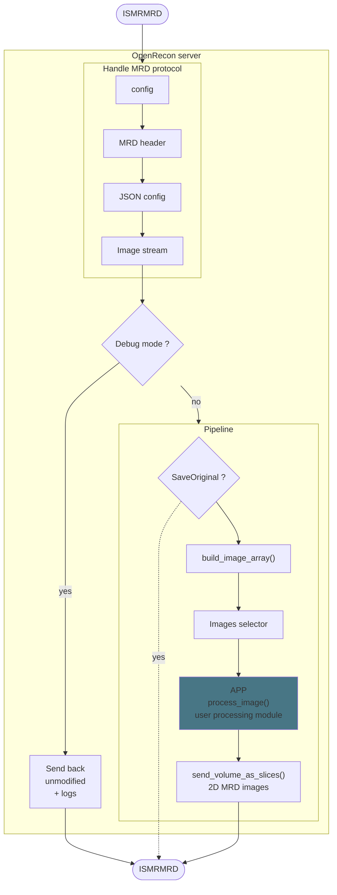
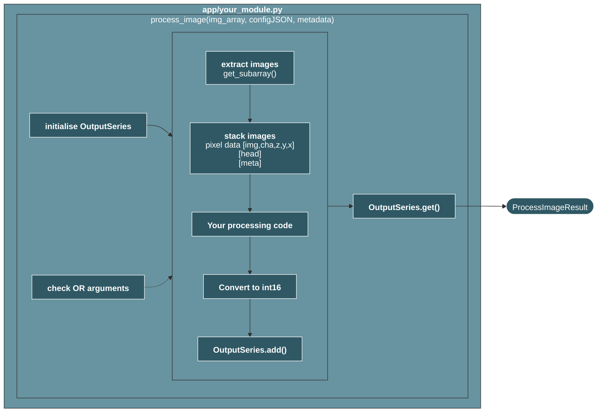

# python-openrecon-server

A Python template to help building MRD image processing pipelines for Siemens OpenRecon.
The puropose is to build a simple invert contrast `i2i` application as described by Siemens on the SDK on [MAGNETOM Community](https://www.magnetom.net), using a single build script, without any modification.

For later developments, the first step of a new OpenRecon project it to create a new repo based on this `python-openrecon-server`, then modify the `app` dir (or any other dir), to finnaly call the building process.

The repository of [kspaceKelvin/python-ismrmrd-server](https://github.com/kspaceKelvin/python-ismrmrd-server) was used as a reference in the development of the server part of this project.


## Table of contents

- [Overview](#overview)
- [Requirements](#requirements)
- [Installation](#installation)
- [Building and packaging](#building-and-packaging)
- [Writing a processing module](#writing-a-processing-module)
- [Testing locally](#testing-locally)
- [Running the test suite](#running-the-test-suite)
- [Debug mode](#debug-mode)
- [Converter](#converter)
- [Project structure](#project-structure)
- [Examples](#examples)


## Overview

The server receives MRD images, organises them into a structured nD array,
calls your `process_image()` function, and sends the results back slice by
slice.



Flowchart example of a generic processing module:


---

## Requirements

A Python environment manager is **strongly** recomanded.

- [Docker](https://www.docker.com/products/docker-desktop) (version < 25, Siemens constraint)
- git
- zip
- `python 3.12`

```bash
pip install jsonschema=4.26.0
```

## Installation
 
All Python dependencies are declared in [`pyproject.toml`](pyproject.toml). Versions are pinned
to match the base Docker image (see [`MRD.Dockerfile`](MRD.Dockerfile)) so local runs and the
packaged OpenRecon container behave the same way.
 
```bash
# setup an environment (conda example)
conda create --name openrecon-template python=3.12
conda activate openrecon-template
 
# runtime dependencies only
pip install .

# development dependencies for local development
pip install -e ".[dev]"
 
# runtime + test dependencies (recommended for local development)
pip install -e ".[dev,test]"
```


## Building and packaging
 
The `build.py` script automates the full build pipeline to allow the deployment on the scanner :

```bash
python build.py --dirname <app>
```
By default, it build the `app` directory. 
The name off the process is automatically get from the name of the `.py` file in the directory.

This script will build the Docker image of the OpenRecon application and all the necessary files to upload it on the magnet.
Meaning, the `.zip`file containing the image as a `.tar` and a minimalistic `.pdf`.

Steps performed:

1. Checks system dependencies (`docker`, `zip`, `git`) and Docker version.
2. Verifies required files in the application directory.
3. Builds the base `python-openrecon-server` Docker image if not present.
4. Validates the JSON UI file against its schema.
5. Generates the final Dockerfile with the OpenRecon metadata label.
6. Builds the application Docker image.
7. Exports the image as `.tar`, generates a PDF if none was given, and bundles both into a `.zip`.

### Build options

| Argument      | Description                                              |
|---------------|----------------------------------------------------------|
| `--dirname`   | Application directory name. Default: `app`               |
| `--pdf-file`  | optional PDF file. Default : `None`
| `--debug`     | Embed `--debug` flag in the Dockerfile CMD               |
| `--nopackage` | Skip `.tar`, PDF and `.zip` packaging (build image only) |

### Required files in the application directory

| File                         | Description                     |
|------------------------------|---------------------------------|
| `<name>_json_ui.json`        | OpenRecon UI parameter          |
| `OpenReconSchema_1.1.0.json` | JSON schema for JSON validation |
| `<name>.py`                  | Processing module               |
| `application.Dockerfile`     | Application-specific Dockerfile |  

> _**Warning** : the name in the processing app and OpenRecon UI parameter have to be identical._

See OpenRecon SDK from [MAGNETOM Community](https://www.magnetom.net) for documentation about JSON file.

### Output

All output files will be placed in a `build` dir. The finale file, ready for the upload on the magnet will be the `.zip` file.

## Writing a processing module

Create a Python file in the `app/` directory. It must expose a function with this prototype:

```python
@timeit
def process_image(
    img_array:  np.ndarray[ismrmrd.Image],
    configJSON: dict | None,
    metadata,
) -> ProcessImageResult :
```
> _The decorator `@timeit` from `utils.memory` is optional and used to log the processing time of the function._

### Parameters

| Parameter    | Type                        | Description                           |
|--------------|-----------------------------|---------------------------------------|
| `img_array`  | `np.ndarray[ismrmrd.Image]` | ND structured array of MRD images     |
| `configJSON` | `dict` or `None`            | JSON configuration sent by the client |
| `metadata`   | `ismrmrd.xsd.ismrmrdHeader` | MRD acquisition header                |

### Accessing OpenRecon JSON UI Configuration

Processing parameters can be passed at runtime via a JSON configuration
sent by the client. Use `check_OR_arguments()` to read them safely with
a default fallback:

```python
from utils.utils import check_OR_arguments

# Read a string parameter, default to 'SimpleSum'
mode = check_OR_arguments(configJSON, "EchoSumConfig", str, "SimpleSum")

# Read a boolean parameter, default to False
save = check_OR_arguments(configJSON, "SaveOriginal", bool, False)
```

#### Reserved keys

The following keys are handled by the pipeline and do not need to be
read manually in `process_image`:

| Key              | Type     | Default | Description                                |
|------------------|----------|---------|--------------------------------------------|
| `"Debug"`        | `bool`   | `False` | Enable debug mode                          |
| `"SaveOriginal"` | `bool`   | `True`  | Send original images before processed ones |
| `"ImageType"`    | `choice` | `All`   | Select the image type on which to apply process      |
| `"SelectEcho"` | `choice` | `All`   | Select the echos on which to apply process           |
| `"SelectSerie"` | `choice` | `All`   | Select the series on which to apply process          |

> _If they are not provided in the JSON configuration, they default value will be used._

### The image array

Images are organised in a 8D numpy array:

**`img_array[slice, contrast, average, phase, repetition, set, image_type, image_series_index]`**

> _See `mrd_indexes` in utils.img_array if you want to modify this array._

Each cell contains an `ismrmrd.Image` object or `None`. `image_type` uses MRD constants directly as indices:

| Constant                   | Value |
|----------------------------|-------|
| `ismrmrd.IMTYPE_MAGNITUDE` | 1     |
| `ismrmrd.IMTYPE_PHASE`     | 2     |
| `ismrmrd.IMTYPE_REAL`      | 3     |
| `ismrmrd.IMTYPE_IMAG`      | 4     |
| `ismrmrd.IMTYPE_COMPLEX`   | 5     |
| `ismrmrd.IMTYPE_RGB`       | 6     |

### Accessing images

To get the specific images that you need, you can use the following functions:
`get_subarray`, `get_type_magnitude`, `get_type_phase`, `get_contrast` from `utils.img_array`.

examples :
```python
from utils.img_array import get_type_magnitude, get_type_phase, get_subarray

# All magnitude images
mag_array = get_type_magnitude(img_array)

# Specific contrast
co0 = get_contrast(img_array, img_contrast=0)

# First 100 slices, magnitude only
subarray = get_subarray(img_array, img_slice=slice(0,100), img_image_type=ismrmrd.IMTYPE_MAGNITUDE)
```

### Stacking images

[MRD images](https://ismrmrd.readthedocs.io/en/latest/mrd_image_data.html)
are 2D slices. Use `stack_images()` to extract pixel data, headers, and
metadata in one call. Since MRD stores data as `[cha, z, y, x]`, the
stacked array has shape **`[img, cha, z, y, x]`**.

```python
from utils.img_array import stack_images

data, head, meta = stack_images(img_array, dtype=float32)
```

### Managing output series

Use `OutputSeries` from `utils.OutputSeries` to manage the images to
send back to the client. It handles metadata updates, deep copies of
headers, and series index offsets automatically.

```python
from utils.OutputSeries import OutputSeries

# Initialise
series = OutputSeries()

# Add one or more output series
series.add(
    data                 = processed_volume,    # [img, cha, z, y, x], dtype int16
    head                 = head,                # reference headers
    meta                 = meta,                # reference metadata
    process_history      = ["PYTHON", "MY_PROCESS"],  # shown in ImageProcessingHistory
    sequence_description = "myprocess",               # shown as series label in the client
)

return series.get()
```

Each call to `series.add()` creates an independent series with its own
copy of the headers and metadata. The `image_series_index` is incremented
automatically for each new series so they appear as distinct series in
the client UI.

### Return value

`process_image` must return `series.get()`, a list of
`(data, head, meta)` tuples, one per output series:

```python
# Single output series (most common case)
series = OutputSeries()
series.add(
        data                 = processed_volume,
        head                 = head,
        meta                 = meta,
        process_history      = ["PYTHON", "MY_PROCESS"],
        sequence_description = "myprocess",
    )
return series.get()
```

The pipeline iterates over the list and calls `send_volume_as_2Dslices()`
for each series, which re-slices the volume back into 2D MRD images
and sends them to the client one by one.

### Sending multiple series

`OutputSeries` is particularly useful when your processing produces
several output series (intermediate results, brain masks, different
processing steps, etc...):

```python
series = OutputSeries()

# Optional intermediate result
if save_intermediate:
    series.add(
        data                 = intermediate_volume,
        head                 = head,
        meta                 = meta,
        process_history      = ["PYTHON", "STEP1"],
        sequence_description = "step1",
    )

# Final result
series.add(
    data                 = final_volume,
    head                 = head,
    meta                 = meta,
    process_history      = ["PYTHON", "STEP1", "STEP2"],
    sequence_description = "step1step2",
)

return series.get()   # pipeline sends both series
```


## Debug mode

When debug mode is active, images are sent back to the client unmodified
and `process_image` is never called. Infos from each image's metadata is
logged (image type, orientation, all FIRST/LAST flags,...).
_This mode is made to be use on the magnet, since the metadata information from DICOM converted images will be incomplete._

- Enable at startup:
```bash
python main.py --debug --config <your_module> --dirname <app>
```
_**Warning** : `--debug` at startup overrun any JSON configuration. The processing module will **never** be called._

- Enable at runtime in the UI / via JSON:
```json
{ "Debug": true }
```

## Testing locally

### Workflow

1. Run the main.py in a first terminal :

```bash
python main.py --config <your_module> --dirname <app>
```
Available arguments:

| Argument    | Default          | Description                                    |
|-------------|------------------|------------------------------------------------|
| `--config`  | `invertcontrast` | Processing module name (without `.py`)         |
| `--dirname` | `app`            | Directory containing the processing module     |
| `-H`        | `0.0.0.0`        | Host address                                   |
| `-p`        | `9002`           | TCP port                                       |
| `-v`        | —                | Verbose logging                                |
| `--debug`   | —                | Enable debug mode (passthrough, no processing) |
| `-l`        | —                | Log file path                                  |

2. _(Optional) If you dont have MRD file, convert DICOMs or enhanced DICOMs images to MRD images .h5 file:_

```bash
# DICOMs converter
python  -m converter.dicom2mrd <folder of DICOMs> -o <outfile>

# Enhanced DICOMs converter
python -m converter.enhanceddicom2mrd <folder of DICOMs> -o <outfile>
```

3. Run the client.py, on another terminal, to send the MRD images :
```bash
python client.py -o <output.h5> <input.h5>
```

4. The output `.h5` file can be converted back to DICOM for visualisation :
```bash
python -m converter.mrd2dicom -o <outdir> <mrdfile>.h5
```

### Testing with Docker

Follow the same workflow than before but replace the first step by this one :

1. Run the `build.py`script with the name of your app directory:
```bash
# --nopackage option to skip the packaging part
python build.py --nopackage -d <app>
```

2. Run the Docker Image:
```bash
docker run -p 9002:9002 -t <image_name>:<image_version>
```

## Running the test suite
 
The project uses [`pytest`](https://docs.pytest.org/). Install the `dev` extra first (see
[Installation](#installation)):
 
```bash
pip install -e ".[dev]"
```
 
Fast unit suite, excludes slow / real-data integration tests (recommended for local dev and pre-merge CI)(`-rs` also prints the reason for skipped tests):
 
```bash
pytest -v -rs -m "not integration"
```
 
Full suite, including integration tests :
 
```bash
pytest -v
```
 
Markers are declared in [`pytest.ini`](pytest.ini):
 
| Marker        | Meaning                                                                 |
|---------------|--------------------------------------------------------------------------|
| `integration` | End-to-end tests exercising real sockets and/or real MRD sample files. |
 
Tests using the `mrd_sample_dataset` / `mrd_sample_path` fixtures (see [`conftest.py`](conftest.py))
expect real MRD `.h5` sample files under `data/` at the repository root. If that folder is
absent or empty, those tests are automatically skipped by pytest rather than failing.
 
Useful fixtures provided by `conftest.py`:
 
| Fixture                                 | Purpose                                                                 |
|------------------------------------------|--------------------------------------------------------------------------|
| `make_image` / `make_header`            | Build real `ismrmrd.Image` / `ismrmrd.ImageHeader` objects for tests.  |
| `fake_connection`                        | Minimal `Connection` double exposing only `send_image`/`send_logging`/`send_close`, for `Pipeline` tests. |
| `socketpair`                             | A real connected pair of `AF_UNIX` sockets, standing in for the TCP client/server socket, for `Connection`/`Server` integration tests. |
| `mrd_sample_dataset` / `mrd_sample_path` | Real captured MRD `.h5` samples, parametrized automatically across every file found in `data/MRD_in/`. |


## Converter

The `converter/` directory provides tools to convert between DICOM, NIfTI and
MRD (`.h5`) format, which is required for local testing.

### DICOM to MRD

Convert a DICOM series (classic or enhanced) to an MRD `.h5` file for use as input to `client.py`:

```bash
# classic DICOM
python -m converter.dicom2mrd --outFile <output.h5> <input_folder>

# enhanced DICOM
python -m converter.enhanceddicom2mrd --outFile <output.h5> <input_folder>
```

DICOM to MRD converter is a refactorisation of the converter from [python-ismrmrd-server](https://github.com/kspaceKelvin/python-ismrmrd-server/blob/master/dicom2mrd.py) with small improvements (handle multi-echo images for example).
In the same way, enhanced DICOM conversion scripts come from : [enhanceddicom2mrd.py](https://github.com/stebo85/python-ismrmrd-server/blob/e52ad7b0417156db138e30a21e437e802aec7a9f/enhanceddicom2mrd.py)


### MRD to DICOM

Convert a processed MRD `.h5` file back to classic DICOM:

```bash
python -m converter.mrd2dicom --out-folder <output_folder> <input.h5>
```
> Source : [kspaceKelvin/python-ismrmrd-server/mrd2dicom.py](https://github.com/kspaceKelvin/python-ismrmrd-server/blob/master/mrd2dicom.py)

### MRD to NIfTI

Convert a MRD `.h5` file to NIfTI format:

```bash
python -m converter.mrd2nifti --out-folder <output_folder> <input.h5>
```


## Project structure

- [**build.py**](build.py) : Build and packaging script: validates, builds, and exports the OpenRecon Docker image as a `.zip` file ready for upload to the scanner.
- [**main.py**](main.py) : Parses command-line arguments and starts the `Server` on the specified host and port.
- [**client.py**](client.py) : Local test client who reads images from an MRD `.h5` file, sends them to the server, and writes the processed results to a new `.h5` file. Used in place of a physical scanner for local development.
- [**MRD.Dockerfile**](MRD.Dockerfile) : Base Docker image containing all ISMRMRD Python dependencies.
- [**Makefile**](Makefile) : Shortcuts for common development tasks (build, run, clean).

- **Server/** :
    - [**connection.py**](server/connection.py) : `Connection` class responsible of the ISMRMRD network communications between the server and the client. Handles different type of message (config, metadata, images, text, close) as described in the [MRD documentation](https://ismrmrd.readthedocs.io/en/latest/mrd_messages.html).
    - [**server.py**](server/server.py) : `Server` class that manages the connection lifecycle and dispatches incoming data. _(Currently, only image data is supported,raw k-space and waveform data are not.)_
    - [**pipeline.py**](server/pipeline.py) : `Pipeline` class that loads and run the application processing module on the received MRD image group, and send back the result.
    - [**debug.py**](server/debug.py) : Functions for the debug mode.
    - [**constants.py**](server/constants.py) : MRD message type identifiers definitions used by the connection protocol.

- **Utils/** :
    - [**img_array.py**](utils/img_array.py) : Core utilities for organising and accessing the MRD images received.
    - [**OutputSeries.py**](utils/OutputSeries.py) : `OutputSeries` helper class (and `ProcessImageResult` type alias) used by processing modules to accumulate and return one or more output series.
    - [**memory.py**](utils/memory.py) : RAM monitoring utilities.
    - [**utils.py**](utils/utils.py) : `check_OR_arguments()`, `send_original_images()`, `display_diagnostic()`, `normalise()`, `MRD5Dto3D()`.

- **App/** :
Default application directory for your application code. Contains the invert contrast example.
    - [**application.Dockerfile**](app/application.Dockerfile) : Application-specific Dockerfile, used as the base for the final image generated by `build.py`.
    - [**invertContrast_json_ui.json**](app/invertContrast_json_ui.json) : OpenRecon UI parameter definition for the contrast inversion application. Defines the parameters shown in the scanner interface.
    - [**invertContrast.py**](app/invertContrast.py): Example processing module. Inverts pixel contrast for each image type present in the dataset.
    - [**OpenReconSchema_1.1.0.json**](app/OpenReconSchema_1.1.0.json) : JSON schema used to validate the JSON UI file before building.

- **EchoSum/** : Example application that combines multi-echo magnitude images.
    - [**application.Dockerfile**](echoSum/application.Dockerfile) : Application-specific Dockerfile, used as the base for the final image generated by `build.py`.
    - [**echoSum_json_ui.json**](echoSum/echoSum_json_ui.json) : OpenRecon UI definition exposing the `EchoSumConfig` parameter to the scanner interface.
    - [**echoSum.py**](echoSum/echoSum.py) : Processing module implementing simple sum and sum-of-squares.
    - [**OpenReconSchema_1.1.0.json**](echoSum/OpenReconSchema_1.1.0.json) : JSON schema used to validate the JSON UI file before building.

- **Converter/** :
Tools to convert between DICOM and MRD format, required for local testing with `client.py`.
    - [**utils.py**](converter/utils.py) : functions shared by the converter scripts below.
    - [**dicom2mrd.py**](converter/dicom2mrd.py) : Converts a folder of classic DICOM files to an MRD `.h5` file.
    - [**enhanceddicom2mrd.py**](converter/enhanceddicom2mrd.py) : Converts enhanced DICOM files to an MRD `.h5` file.
    - [**mrd2dicom.py**](converter/mrd2dicom.py): Converts a processed MRD `.h5` file back to classic DICOM.
    - [**mrd2nifti.py**](converter/mrd2nifti.py) : Converts an MRD `.h5` file (or an in-memory MRD image array) to NIfTI, auto-detecting extra dimensions (contrast, phase, repetition, set, average).
    - [**nifti2mrd.py**](converter/nifti2mrd.py) : Rebuilds `ismrmrd.Image` objects from a NIfTI volume produced by an external tool, reusing geometry/metadata from the original MRD images.


## Examples

### Invert Contrast

Simple application that invert the contrast of images:

```bash
python main.py
```
- Package for use on the magnet:
```bash
python build.py
```

### Multi-Echo Combination

Combines multi-echo magnitude images into a single image per slice.
Different mode are available: simple summation (default) or sum of square.

- local test:
```bash
python main.py -c echoSum -d echoSum/
```
- Package for use on the magnet:
```bash
python build.py --dirname echoSum
```

- JSON :
```json
// simple sum, default mode
{ "EchoSumConfig": "SimpleSum" }

// Sum of Square
{ "EchoSumConfig": "SoS" }
```
